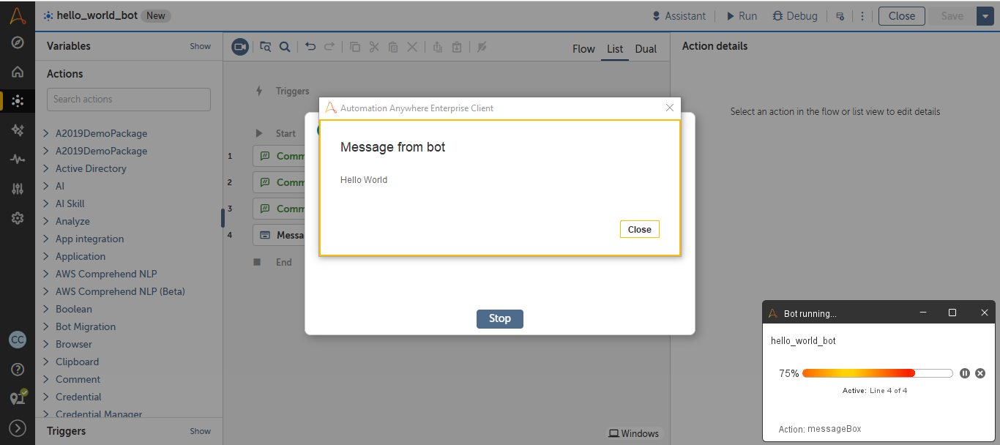

# Hello World Bot - Automation Anywhere A360 (Community Edition)

## 📌 Overview
This is my first bot created in **Automation Anywhere A360 (Community Edition)**.  
The bot simply displays a message box with the text **"Hello World"**.  
It’s a beginner-friendly example to understand how bot creation works in Automation Anywhere.

---

## ⚙️ Bot Logic
1. **Start**  
2. **Message Box Action** → Text: `Hello World`  
3. **End**

---

## 🖼️ Screenshot

Workflow:
 

Example:  

---

## How to Recreate This Bot  
1. Log in to Automation Anywhere A360 (Community Edition).  
2. Go to **My Bots → Create a new Bot**.  
3. Add a **Message Box** action with `"Hello World"`.  
4. Save and run—it should show the pop-up.

---

## 🗂️ Repository Structure
hello-world-bot/

|- README.md

|- hello_world_bot.png # Workflow screenshot

|- hello_world_bot_screenshot.png # Output screenshot

---

## Metadata  
**Author**: Vijaya Sree Janjanam

**Created**: 01-Sep-2025

---

---

## 🚀 Next Steps
- Upcoming bots (variables, exception handling).
- Visit my next repositories for other bot automation solutions.

---
